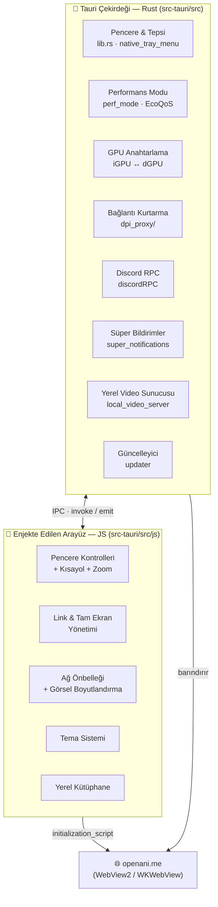

<div align="center">


# OpenAnime Desktop

**[OpenAnime](https://openani.me) platformu için geliştirilmiş; donanım hızlandırmalı, ultra hafif, native masaüstü istemcisi.**

<br/>


[](https://github.com/Dark-Hunter-TR/OpenAnime-Desktops/releases/latest)
[](https://github.com/Dark-Hunter-TR/OpenAnime-Desktops/releases)
[](https://github.com/Dark-Hunter-TR/OpenAnime-Desktops/stargazers)
[](./LICENSE)

</div>

---

## &nbsp; Proje Hakkında

Bu depo, **[OpenAnime](https://openani.me)** platformu için geliştirilmiş; resmî olmayan ama sitenin kurucularının bilgisi ve onayı dahilinde hazırlanmış bir masaüstü istemcisidir.

OpenAnime'ın resmî masaüstü uygulaması yalnızca **Windows** için sunulmaktadır ([resmî indirme sayfası](https://ors.openani.me/tr)). Bu proje ise aynı web deneyimini; **Tauri v2 (Rust)** çekirdeği üzerine inşa edilmiş, donanım hızlandırmalı bir kabuk (shell) içine alarak **Windows** ve **macOS**'ta native bir uygulama haline getirir.

Web, resmî Windows uygulaması veya bu istemci — içerik ve işlevsellik olarak aralarında fark yoktur. Bu proje; donanım anahtarlama (GPU switching), akıllı performans/verimlilik modu, çerçevesiz pencere yönetimi, yerel video kütüphanesi, native masaüstü bildirimleri ve detaylı Discord Zengin Varlık (Rich Presence) gibi ekstra bir katman sunar.

> [!NOTE]
> Bu proje topluluk tarafından geliştirilmektedir, OpenAnime'ın resmî bir ürünü değildir.

---

## &nbsp; Mimari Genel Bakış

Proje, **native çekirdek (Rust/Tauri)** ve webview içine enjekte edilen **arayüz katmanı (JS modülleri)** olarak iki ana parçadan oluşur. Çekirdek `openani.me`'yi bir webview'da barındırırken, üzerine "yerlileştirme" (native-like) katmanları ekler.



| Katman | Konum | Sorumluluk |
| --- | --- | --- |
| **Native Çekirdek** | `src-tauri/src/*.rs` | Pencere & tepsi, GPU anahtarlama, performans modu, bağlantı kurtarma, Discord RPC, bildirimler, yerel video sunucusu, güncelleme, IPC komutları |
| **Arayüz Modülleri** | `src-tauri/src/js/` | Webview'a enjekte edilen özel titlebar, kısayollar, zoom, link filtreleme, önbellek, tema ve yerel kütüphane katmanları |
| **SvelteKit Kabuğu** | `src/` | Çevrimdışı/splash ekranları ve statik kabuk (offline navigasyon hedefi) |
| **CI/CD** | `.github/workflows/` | Windows & macOS için otomatik derleme/yayınlama |

---

## &nbsp; Öne Çıkan Özellikler

### &nbsp; Donanım & GPU Optimizasyonu

- **Akıllı Ekran Kartı Seçimi:** Video oynatıcı aktifken sistem yüksek performanslı GPU'yu (NVIDIA/AMD dGPU) devreye sokar; katalog gezinirken entegre GPU'ya (iGPU) geçerek pil ömrünü ve fan gürültüsünü optimize eder. Windows tarafında DirectX `UserGpuPreferences` kaydı ve `--force-gpu-selection=high-performance` bayrağıyla, macOS'ta ise ayrı bir CGL bağlamı açarak dGPU zorlanır.
- **WebGPU Hızlandırma:** Video ve render katmanlarında GPU kompozisyonu zorlanarak 4K/60 FPS yayınların takılmadan oynatılması hedeflenir.
- **Düşük Kaynak Tüketimi:** Electron tabanlı alternatiflerin aksine diskte 10 MB'tan az yer kaplar, düşük RAM ayak izine sahiptir.

### &nbsp; Akıllı Performans / Verimlilik Modu *(Windows)*

Uygulama, ne yaptığınıza göre kaynak kullanımını gerçek zamanlı ayarlar:

- **Tam performans yalnızca gerektiğinde:** _Video oynuyor **ve** pencere odakta_ iken tam performans; diğer tüm durumlarda (ana sayfa, duraklatılmış video, alt-tab) verimlilik moduna geçilir.
- **Çift mekanizma:** WebView2 bellek hedefi (`SetMemoryUsageTargetLevel`) ile Chromium önbellekleri boşaltılır; **EcoQoS** ile CPU/güç tüketimi düşürülür.
- **Arka planda askıya alma:** Pencere küçültüldüğünde veya tepsiye gizlendiğinde (ve video oynamıyorken) WebView motoru dondurulur ve çalışma seti (working set) RAM'den boşaltılır — arka planda dinlerken/izlerken ise askıya alınmaz.

### &nbsp; Çerçevesiz Tasarım & Özel Arayüz

- Pencere kenarlıkları kaldırılmış, minimalist çerçevesiz (frameless) tasarım.
- Fluent System Icons ([fluenticons.co](https://fluenticons.co)) kullanılarak Tauri'nin pencere API'si üzerine inşa edilmiş özel Kapat/Küçült/Büyüt kontrolleri — zoom seviyesinden etkilenmeden her zaman stabil ve tıklanabilir kalır.
- İlk açılışta ekran sınırlarına göre otomatik ortalama; pencere boyutu ve maksimize durumu oturumlar arası hafızada tutulur.

### &nbsp; Yerel Kütüphane & Kopyasız Video Oynatma

İndirdiğiniz bölümleri, uygulamanın kendi oynatıcısında izleyebilirsiniz:

- Sidebar'a eklenen **"Kütüphanem"** ve **bölüm ekle** butonlarıyla yerel video dosyalarınızı (`.mp4`, `.mkv`, `.webm`, `.avi`, `.mov`) kütüphanenize ekleyin.
- Rust tarafında çalışan küçük bir yerel HTTP sunucusu (`127.0.0.1`), dosyayı **hiç kopyalamadan** doğrudan diskten stream eder — IndexedDB şişmesi yok, GB boyutundaki dosyalar sorunsuz çalışır.
- **Range/byte** istekleri desteklendiğinden ileri-geri sarma (seeking) tam çalışır; video sitenin WebGPU oynatıcısında açılır.

### &nbsp; Discord Zengin Varlık (Rich Presence)

Resmî uygulamadaki temel RPC entegrasyonunun kat kat ötesinde, gerçek zamanlı ve detaylı bir deneyim:

- **Bulunulan sayfa bilgisi:** Uygulamada tam olarak ne yaptığınız (anime izleniyor, katalogda geziniliyor vb.) Discord profilinize anlık yansır.
- **Anime adı ve kapak görseli:** İzlenen animenin ismi ve kapak fotoğrafı RPC kartında gösterilir.
- **Canlı zaman takibi:** Videonun kaçıncı dakikasında olduğunuz ve toplam süre (dakika:saniye) gerçek zamanlı güncellenir.
- **Duraklatma sayacı:** Video duraklatıldığında ne kadar süredir duraklatılmış olduğunu gösteren ayrı bir sayaç devreye girer.
- **"Profile Git" butonu:** Hesabınıza giriş yaptıysanız RPC kartına tıklanabilir bir buton eklenir; giriş yapılmamışsa gösterilmez.

### &nbsp; Süper Bildirimler (Native Masaüstü Bildirimleri)

- OpenAnime bildirimleri, uygulama **tepsideyken veya pencere kapalıyken bile** native masaüstü toast'ı olarak gösterilir.
- Sitenin kendi bildirim akışına (**SSE** — Server-Sent Events) doğrudan Rust'tan bağlanılır: **poll yok**, gecikme sıfıra yakın, boşta CPU harcamaz. Bağlantı koparsa artan bekleyişle (backoff) otomatik yeniden bağlanır.
- Toast'a tıklamak ilgili bildirimi açar. `/settings` içine eklenen ayar kartından açıp kapatılabilir.

### &nbsp; Süper Açılış *(Yakında)*

> [!NOTE]
> Bu özellik henüz geliştirme aşamasındadır — yakında eklenecektir.

Sitenin varsayılan yükleme ekranının yerine, uygulamaya özel, **animasyonlu ve şık bir açılış/yükleme ekranı** getirmeyi hedefler. Sizi düz bir boş ekranla değil, akıcı bir karşılama animasyonuyla karşılamak amacıyla **video/MP4 tabanlı** animasyonlar da desteklenecek.

### &nbsp; Sistem Tepsisi (Tray) Entegrasyonu

- Pencereyi kapattığınızda (X) uygulama **tepsiye gizlenir**, arka planda çalışmaya devam eder; tamamen çıkış tepsi menüsündeki **Çıkış** ile yapılır.
- Sitenin koyu/Fluent estetiğine uyan **özel tasarım tepsi menüsü**: giriş yapılmışsa avatar + kullanıcı adı başlığı ve **Aç / Profil / Kütüphanem / Son Eklenenler / Takvim / Çıkış** kısayolları; giriş yoksa yalnızca **Aç / Çıkış**.

### &nbsp; Akıllı Tarayıcı & Bağlantı Yönetimi

- OpenAnime dışındaki tüm harici bağlantılar (Discord davetleri, sosyal medya vb.) sistemin varsayılan tarayıcısında güvenli şekilde açılır.
- Fare 4./5. tuşları, `Backspace` veya `Alt + Sol/Sağ Yön Tuşları` ile gelişmiş geri/ileri navigasyon.
- `Ctrl + Sol Tık` ile bağlantılar ayrı bir native pencerede açılır.

### &nbsp; Dinamik Yakınlaştırma

- `Ctrl + Fare Tekerleği` veya `Ctrl + +/-` ile **%30–%200** arası sayfa yakınlaştırma (ekran boyutuna göre otomatik sınırlandırılır); seviye oturumlar arası korunur ve tüm pencereler arasında paylaşılır.

### &nbsp; Akıllı Bağlantı Kurtarma & DPI Atlatma *(Windows)*

- Açılışta **3 aşamalı otomatik bağlantı akışı** çalışır: **(1)** doğrudan bağlantı denenir → **(2)** engel varsa yerleşik DPI atlatma yöntemleri (TLS parçalama vb.) taranır → **(3)** hiçbiri olmazsa uzak proxy'ye düşülür (fallback).
- ISS (internet servis sağlayıcısı) kaynaklı DPI (Deep Packet Inspection) engellemeleri, yerleşik proxy (`127.0.0.1:1453`) üzerinden sessizce arka planda aşılır; kullanıcı elle işlem yapmaz. Sistemde ayrıca **[GoodbyeDPI](https://github.com/ValdikSS/GoodbyeDPI)** çalışıyorsa o da algılanır.
- Uygulama kapatıldığında arkada bir aşım süreci bırakılmaz.

### &nbsp; Çevrimdışı & Bakım Tespiti

- **Otomatik çevrimdışı modu:** Bağlantı koptuğunda uygulama anında algılar ve çevrimdışı ekranına geçer.
- **Sunucu erişilebilirlik kontrolü:** OpenAnime sunucularına ulaşılamadığında veya bir bakım/kesinti tespit edildiğinde, boş bir hata ekranı yerine bilgilendirici bir durum sayfası gösterilir; **"Tekrar Dene"** ve **"Sunucu Durumunu Kontrol Et"** aksiyonlarını sunar.
- **Sayfa kurtarma:** Web tarafındaki beklenmedik çökme/donmalar arka planda yakalanıp sayfa otomatik toparlanmaya çalışılır.

### &nbsp; Uygulama İçi Güncelleyici

- **İmzalı** güncellemeler (minisign) uygulama içinden kontrol edilip indirilir; yeni sürüm çıktığında uygulama içi bir arayüzle bildirilir.
- İnteraktif kurulum başlatıldığında, installer penceresi açıldıktan sonra kurulum aşamasında GitHub'daki en son sürüme otomatik yönlendirme yapılır (ağ hatasında gömülü sürüm normal kurulur — fail-open).

### &nbsp; Tema Sistemi *(Deneysel)*

> [!WARNING]
> Bu özellik **deneysel geliştirme aşamasındadır**, henüz kararlı sürümde yer almamaktadır. Arayüz ve işlevsellik detayları değişebilir.

OpenAnime topluluğunun geliştirdiği siteye özel temaları uygulama içinden keşfedip yükleyebileceğiniz bir **Tema Sayfası** hedeflenmektedir:

- Temalar bir **GitHub reposu** yapısında barındırılır; uygulama JSON tema tanımlarını yerel veriden (`themes/`) okuyup uygular.
- Tema Sayfası'nda sıralama: ⭐ **Yıldız sayısı** · 📅 **Aylık en çok indirilen** · ❤️ **En çok sevilen**.

---

## &nbsp; Kurulum

### &nbsp; Windows &nbsp;·&nbsp; `Windows 10/11 — x86_64`

| Yöntem | Boyut | Açıklama |
|--------|-------|----------|
| **[NSIS Kurulum](https://github.com/Dark-Hunter-TR/OpenAnime-Desktops/releases/latest)** | ~10 MB | GitHub Releases sayfasından `.exe` indir, çift tıkla kur |
| **winget** *(yakında)* | — | `winget install OpenAnime` |

> [!TIP]
> Windows Defender SmartScreen uyarısı alırsanız **"Ek bilgi" → "Yine de çalıştır"** deyin. Uygulama henüz kod imzalı değildir.

### &nbsp; macOS &nbsp;·&nbsp; `macOS 12+ — Apple Silicon & Intel`

| Yöntem | Boyut | Açıklama |
|--------|-------|----------|
| **[DMG Kurulum](https://github.com/Dark-Hunter-TR/OpenAnime-Desktops/releases/latest)** | ~15 MB | `.dmg` indir, uygulamayı `Applications` klasörüne sürükle |
| **[Homebrew](https://brew.sh)** *(yakında)* | — | `brew install openanime-desktop` |

> Apple Silicon (M serisi) ve Intel Mac'lerde aynı DMG içinde evrensel binary çalışır.

---

## &nbsp; Platform Desteği

| Platform | Durum | Paketler | Notlar |
| --- | --- | --- | --- |
| 🪟 **Windows** | ✅ Tam destek | `.exe` (NSIS) | Tüm native özellikler (perf modu, DPI atlatma, tepsi, native bildirim) etkin |
| 🍎 **macOS** | ✅ Tam destek | `.dmg` | Apple Silicon + Intel evrensel binary; GPU anahtarlama CGL ile |

> Performans/verimlilik modu, DPI atlatma ve native toast bildirimleri Windows'a özgü platform API'lerine dayandığından şu an için Windows derlemesinde etkindir.

---

## &nbsp; Kısayollar ve Kontroller

| Kısayol | İşlev |
| --- | --- |
| `Ctrl + Shift + I` | Geliştirici Araçları (DevTools) *(yalnızca geliştirici modunda)* |
| `F5` / `Ctrl + R` | Sayfayı yeniler |
| `Ctrl` + `+` / `=` | Yakınlaştırır |
| `Ctrl` + `-` | Uzaklaştırır |
| `Ctrl` + `0` | Yakınlaştırmayı sıfırlar (%100) |
| `Ctrl` + `Fare Tekerleği` | Dinamik yakınlaştırma |
| `Alt` + `←` / `Backspace` | Geri git |
| `Alt` + `→` | İleri git |
| `Fare 4 / 5` | Geri / İleri git |
| `Ctrl` + `Sol Tık` | Bağlantıyı yeni pencerede aç |

---

## &nbsp; Kaynaktan Derleme

### 1. Ön Gereksinimler

- [Rust](https://www.rust-lang.org/tools/install) (Tauri çekirdeği için)
- [Bun](https://bun.sh/) *(önerilen)* veya [Node.js/npm](https://nodejs.org/)
- Platforma özel Tauri v2 sistem bağımlılıkları — bkz. [Tauri Ön Gereksinimleri](https://tauri.app/start/prerequisites/)

### 2. Klonla & Çalıştır

```bash
git clone https://github.com/Dark-Hunter-TR/OpenAnime-Desktops.git
cd OpenAnime-Desktops

# Bağımlılıkları yükle
bun install        # veya: npm install

# Geliştirici modunda başlat (native pencere + hot reload)
bun run tauri:dev  # veya: npm run tauri:dev
```

> Yalnızca arayüz kabuğunu tarayıcıda çalıştırmak için `bun run dev` yeterlidir; ancak native özellikler (GPU, tepsi, bildirim vb.) için `tauri:dev` gerekir.

### 3. Yerel Paketleme (Build)

```bash
bun run tauri:build   # veya: npm run tauri:build
```

| Platform | Gereksinim | Çıktı |
| --- | --- | --- |
| Windows | — | `.exe` (NSIS) |
| macOS | Xcode Command Line Tools yüklü bir Mac | `.dmg` |

---

## &nbsp; CI/CD — Otomatik Bulut Derleme

Her platforma yerel erişiminiz yoksa `.github/workflows/` altındaki GitHub Actions iş akışlarını kullanabilirsiniz. Bir sürüm etiketi (tag) push edildiğinde Windows ve macOS runner'ları paketleri otomatik derler:

```bash
git tag v1.0.2
git push origin v1.0.2
```

Derleme tamamlandığında kurulum dosyaları deponun **Releases** sekmesinde otomatik yayınlanır. Ayrıca `🧪 Test Build` iş akışı **workflow_dispatch** ile elle tetiklenebilir (platform ve build modu seçilerek).

---

## &nbsp; Yol Haritası

- [ ] **Tema Sistemi:** GitHub reposu tabanlı topluluk temalarının keşfedilip yüklenebildiği Tema Sayfası (yıldız / aylık en çok indirilen / en çok sevilen sıralamalarıyla)
- [ ] **Süper Açılış:** sitenin varsayılan yükleme ekranı yerine özel, animasyonlu (MP4) açılış/yükleme ekranı
- [ ] **winget** ve **Homebrew** paket dağıtımı
- [ ] Kod imzalama (Windows SmartScreen / macOS notarization)
- [ ] Genel kararlılık ve hata düzeltmeleri (özellik eklemelerinden önceliklendirilir)

Güncel görevler ve bilinen sorunlar için [Issues](https://github.com/Dark-Hunter-TR/OpenAnime-Desktops/issues) sekmesine göz atabilirsiniz.

---

## &nbsp; Katkıda Bulunma

Katkılar memnuniyetle karşılanır! 

1. Bir issue açmadan önce mevcut [Issues](https://github.com/Dark-Hunter-TR/OpenAnime-Desktops/issues) listesini kontrol edin.
2. Değişikliklerinizi göndermeden önce `bun run tauri:dev` ile yerel olarak test edin.
3. Pull request'inizi açık ve odaklı tutun; ne yaptığını kısaca açıklayın.

---

## &nbsp; Lisans

Bu proje **MIT Lisansı** altında lisanslanmıştır. Detaylar için [LICENSE](./LICENSE) dosyasına bakınız.

---

<div align="center">

Resmî OpenAnime uygulaması için: **[ors.openani.me](https://ors.openani.me/tr)** &nbsp;·&nbsp; Web sürümü için: **[openani.me](https://openani.me)**

<sub>Topluluk tarafından ❤️ ile geliştirildi.</sub>

</div>
