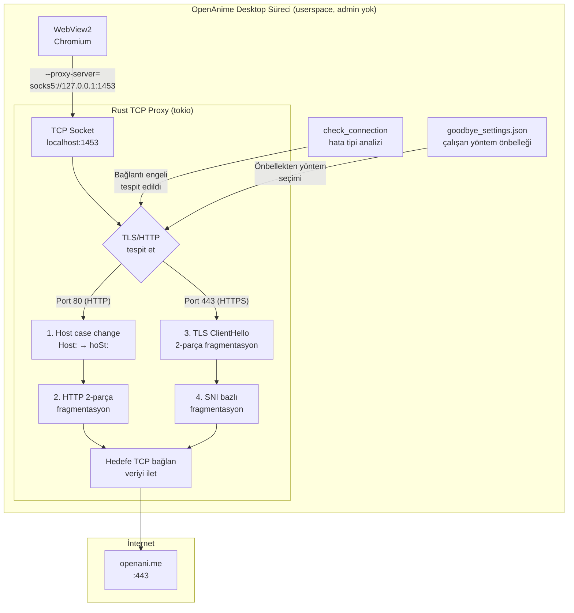
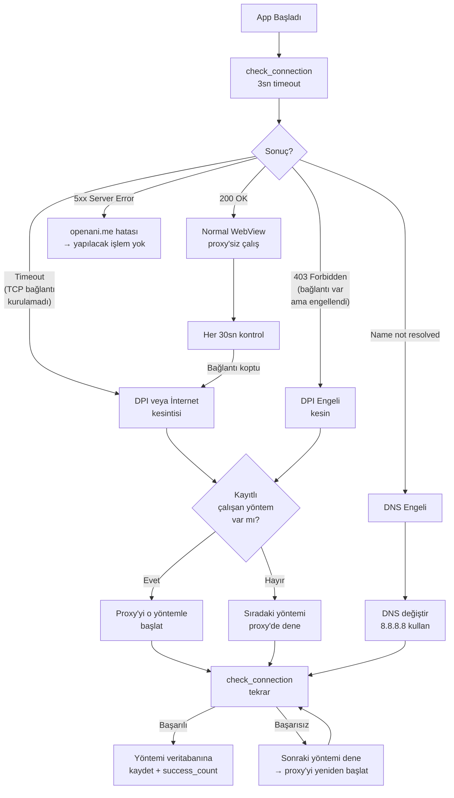
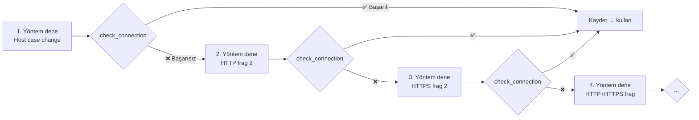

# GoodbyeDPI Entegrasyon Planı — Rust ile Dahili TCP Proxy

## 1. Fizibilite: Hangi Teknikler Taşınabilir?

GoodbyeDPI'nin yaptığı işlemleri analiz ettim:

| Teknik | GoodbyeDPI'de | Rust ile Yapılabilir mi? | Nasıl? |
|--------|---------------|------------------------|--------|
| **Host case change** (`-r`) | `Host:` → `hoSt:` | ✅ **Evet** | HTTP proxy'de string replace |
| **Host mixed case** (`-m`) | `tEsT.cOm` | ✅ **Evet** | Rust'ta byte manipülasyonu |
| **Host space remove** (`-s`) | Boşluk kaldırma | ✅ **Evet** | Header yeniden yazma |
| **HTTP fragment** (`-f 2`) | Paketi 2 parçaya böl | ✅ **Evet** | TCP proxy'de write'ları ikiye böl |
| **HTTPS fragment** (`-e 2`) | TLS ClientHello'u 2 parça | ✅ **Evet** | TCP proxy'de TLS verisini 2 parçada yolla |
| **SNI bazlı fragment** (`--frag-by-sni`) | SNI değerinden hemen önce parçala | ✅ **Evet** | TLS ClientHello'da SNI extension'ı parse et |
| **Native frag (split)** (`--native-frag`) | TCP segment seviyesinde böl | ✅ **Evet** | TCP proxy zaten segmentleri kontrol eder |
| **Reverse frag** (`--reverse-frag`) | Ters sırada gönder | ✅ **Evet** | Önce küçük, sonra büyük parçayı gönder |
| **Fake packets** (`--wrong-chksum`, `--set-ttl`, `--wrong-seq`) | DPI'ı şaşırtmak için sahte TCP paketleri | ❌ **Hayır** | Kernel/WinDivert gerekli |
| **Passive DPI blocking** (`-p`) | HTTP 302 redirect'leri engelle | ❌ **Hayır** | WinDivert gerekli |
| **QUIC blocking** (`-q`) | QUIC/HTTP3'ü engelle | ❌ **Hayır** | WinDivert gerekli |
| **DNS redirect** (`--dns-addr`) | DNS sunucusunu değiştir | ✅ **Kısmen** | `check_connection`'da DNS hatası tespiti |

## 2. Mimari: TCP Proxy Yaklaşımı



## 3. Ne Zaman Tetiklenecek?



## 4. Hata Tipi Analizi (check_connection v2)

Mevcut `check_connection()` sadece `bool` döndürüyor. Bunu detaylandırmalıyız:

```rust
#[derive(serde::Serialize)]
enum ConnectionBlockReason {
    None,                // Bağlantı var, her şey normal
    Timeout,             // TCP bağlantısı kurulamadı (büyük ihtimal DPI)
    Forbidden,           // HTTP 403 (DPI engelledi)
    DnsFailure,          // DNS çözümleme hatası (DNS engeli)
    ServerError,         // 5xx (openani.me sunucu hatası)
    NetworkUnreachable,  // İnternet yok
    TlsError,            // TLS握手 hatası (SNI engeli)
}
```

Tespit yöntemi:
```
1. DNS çözümleme dene (openani.me → IP)
   → Başarısız = DNS_ENGEL
2. TCP connect dene (IP:443, 3sn timeout)
   → Başarısız = TIMEOUT (DPI ağ engeli)
3. TLS handshake dene
   → Başarısız = TLS_ERROR (SNI engeli)
4. HTTP GET isteği at
   → 403 = FORBIDDEN (HTTP seviyesinde engel)
   → 5xx = SERVER_ERROR
   → 200 = NONE
```

## 5. Denenecek Yöntemler (Method Pool)

Her biri farklı DPI atlatma stratejisi:

```rust
struct DpiMethod {
    id: u32,
    name: &'static str,
    description: &'static str,
    // Proxy ayarları
    http_host_case: bool,        // Host: → hoSt:
    http_host_mixedcase: bool,   // tEsT.cOm
    http_host_removespace: bool, // Host:değer (boşluksuz)
    http_fragment_size: u32,     // 0= disabled, 2= önerilen
    https_fragment_size: u32,    // 0= disabled, 2= önerilen
    fragment_by_sni: bool,       // SNI'den önce parçala
    reverse_fragment: bool,      // Parçaları ters sırada gönder
    // İstatistik
    status: MethodStatus,        // working/failed/untested
    success_count: u32,
    last_tested: Option<String>,
}
```

**Yöntem Sırası (önce en hafif):**

| # | Yöntem | Açıklama |
|---|--------|----------|
| 1 | `Host: → hoSt:` | Sadece case değişimi, en hafif |
| 2 | `HTTP frag 2` | HTTP'yi 2 parça, TLS normal |
| 3 | `HTTPS frag 2` | TLS'yi 2 parça |
| 4 | `HTTP+HTTPS frag 2` | İkisini de parçala |
| 5 | `SNI bazlı frag` | SNI extension'ından önce TLS'yi kes |
| 6 | `Reverse frag` | Önce küçük parça, sonra büyük |
| 7 | `Mixed case + frag` | Host case + fragment kombosu |
| 8 | `Tümü + space remove` | En agresif |

## 6. Veritabanı Yapısı

```rust
// goodbye_settings.json
#[derive(serde::Serialize, serde::Deserialize)]
struct GoodbyeSettings {
    version: u32,
    last_updated: String,
    
    // En son başarılı yöntem (bir sonraki açılışta hemen kullanılır)
    active_method_id: Option<u32>,
    
    // Denenmiş tüm yöntemler
    methods: Vec<DpiMethodRecord>,
    
    // Çalışma durumu
    is_active: bool,             // Proxy şu an çalışıyor mu?
    is_blocking_detected: bool,   // ISP engellemesi tespit edildi mi?
    blocked_reason: String,       // Son engel nedeni
    
    // Sistem geneli GoodbyeDPI kontrolü
    system_goodbye_running: bool, // Harici goodbyedpi.exe çalışıyor mu?
}

#[derive(serde::Serialize, serde::Deserialize)]
struct DpiMethodRecord {
    id: u32,
    status: String,  // "working", "failed", "untested"
    success_count: u32,
    fail_count: u32,
    first_success: Option<String>,
    last_tested: Option<String>,
}
```

## 7. TCP Proxy Detayı (Rust)

```rust
use tokio::net::{TcpListener, TcpStream};
use tokio::io::{AsyncReadExt, AsyncWriteExt};

async fn proxy_thread() {
    let listener = TcpListener::bind("127.0.0.1:1453").await?;
    
    loop {
        let (mut client, _) = listener.accept().await?;
        tokio::spawn(handle_connection(client));
    }
}

async fn handle_connection(mut client: TcpStream) {
    // İlk 3 byte'ı oku → TLS mi HTTP mi?
    let mut first_bytes = [0u8; 3];
    client.peek(&mut first_bytes).await?;
    
    // TLS ClientHello: 0x16 0x03 [0x01|0x03]
    let is_tls = first_bytes[0] == 0x16 && first_bytes[1] == 0x03;
    
    // Hedefe bağlan
    let mut server = TcpStream::connect("openani.me:443").await?;
    
    // Yönteme göre fragmentasyon stratejisi uygula
    if is_tls {
        handle_tls_forward(client, server, &method).await;
    } else {
        handle_http_forward(client, server, &method).await;
    }
}

async fn handle_tls_forward(mut client: TcpStream, mut server: TcpStream, method: &DpiMethod) {
    // TLS ClientHello'u parçala
    let mut buf = vec![0u8; 4096];
    let n = client.read(&mut buf).await?;
    
    if method.https_fragment_size > 0 {
        // İlk fragment_size byte'ı gönder
        server.write_all(&buf[..method.https_fragment_size as usize]).await?;
        
        if method.reverse_fragment {
            tokio::time::sleep(Duration::from_millis(2)).await;
        }
        
        // Kalanını gönder
        server.write_all(&buf[method.https_fragment_size as usize..n]).await?;
    } else {
        // Normal ilet
        server.write_all(&buf[..n]).await?;
    }
    
    // Çift yönlü kopyalama (proxy)
    bidirectional_copy(client, server).await;
}
```

## 8. Sistem Geneli GoodbyeDPI Çakışma Kontrolü

```rust
fn is_system_goodbye_running() -> bool {
    // tasklist çıktısını kontrol et
    let output = std::process::Command::new("tasklist")
        .args(&["/FI", "IMAGENAME eq goodbyedpi.exe"])
        .output();
    
    if let Ok(output) = output {
        let stdout = String::from_utf8_lossy(&output.stdout);
        // "goodbyedpi.exe" satırı varsa çalışıyor demektir
        stdout.contains("goodbyedpi.exe")
    } else {
        false
    }
}
```

Eğer çalışıyorsa:
- Kendi proxy'mizi başlatma ama `check_connection` yine başarısızsa → kullanıcıya uyarı
- Çalışmıyorsa → proxy'yi başlat

## 9. WebView2 Proxy Konfigürasyonu

WebView2, `additional_browser_args` ile proxy ayarı alır:

```rust
// lib.rs'de, Windows browser args'a proxy ekle:
#[cfg(target_os = "windows")]
pub const WINDOWS_BROWSER_ARGS: &str = if dpi_active {
    "--proxy-server=socks5://127.0.0.1:1453 ..."
} else {
    "--disable-features=msWebOOUI ..."
};
```

**Önemli:** Proxy'yi sadece DPI atlatma gerektiğinde aktif et. Normal durumda proxy'siz çalış (performans kaybı olmasın).

## 10. Dosya Listesi (Yeni Dosyalar)

| # | Dosya | İçerik | Boyut |
|---|-------|--------|-------|
| 1 | `src-tauri/src/dpi_proxy/mod.rs` | TCP proxy ana modülü | ~150 satır |
| 2 | `src-tauri/src/dpi_proxy/methods.rs` | DPI yöntemleri tanımı | ~80 satır |
| 3 | `src-tauri/src/dpi_proxy/settings.rs` | Veritabanı yönetimi | ~100 satır |
| 4 | `src-tauri/src/dpi_proxy/tcp_forward.rs` | TCP iletme/fragmentasyon | ~200 satır |
| 5 | `src-tauri/src/dpi_proxy/http_mod.rs` | HTTP header manipülasyonu | ~100 satır |
| 6 | `src-tauri/src/dpi_proxy/tls_detect.rs` | TLS ClientHello/SNI analizi | ~80 satır |
| 7 | `src-tauri/permissions/dpi_proxy.toml` | Tauri permission | ~10 satır |

**Mevcut dosyalarda değişiklik:**
- `src-tauri/src/lib.rs`: `mod dpi_proxy;` + 3 yeni Tauri komutu + `check_connection` iyileştirmesi
- `src-tauri/capabilities/default.json`: `"allow-dpi-proxy"` eklentisi
- `tauri.conf.json`: Hiçbir değişiklik (proxy binary gerekmez, her şey Rust içinde)

## 11. Uygulama Kapanırken Temizlik

```rust
impl Drop for DpiProxyManager {
    fn drop(&mut self) {
        // 1. TCP listener'ı kapat
        // 2. Tüm aktif bağlantıları kapat
        // 3. Ayarları kaydet
        // Not: Kernel sürücüsü yok, temizlik gerektirmez!
    }
}
```

**Avantaj:** Proxy tamamen userspace'te çalıştığı için kapanınca hiçbir sistem kaynağı açık kalmaz. WinDivert gibi kernel sürücüsü yok.

## 12. Sınırlamalar

| Özellik | GoodbyeDPI'de Var | Bizde Yok |
|---------|--------------------|-----------|
| Fake packets (TTL/checksum oyunları) | ✅ | ❌ |
| Passive DPI blocking (HTTP redirect engelleme) | ✅ | ❌ |
| QUIC/HTTP3 blocking | ✅ | ❌ |
| Tüm sistem genelinde çalışma | ✅ | ❌ (sadece OpenAnime) |
| Administrator gereksinimi | ✅ (gerekli) | ❌ (gerekmez) |
| Ayrı pencere açılması | ✅ (açılır) | ❌ (açılmaz) |

## 13. Test Süreci



Her yöntem max 5 saniye test edilir. Toplam 8 yöntem = max 40 saniye. Ama çalışan bulunca durur.

## 14. Özet

Bu yaklaşım, GoodbyeDPI'nin **kernel gerektiren kısımları** dışındaki tüm önemli DPI atlatma tekniklerini Rust içinde çalıştırır:
- **Admin gerekmez** ✅
- **Ayrı pencere açılmaz** ✅
- **Sistem ayarlarına dokunmaz** ✅
- **Sadece OpenAnime'yi etkiler** ✅
- **Öğrenir ve önbelleğe alır** ✅
- **App kapanınca tam temizlik** ✅
- **Sistemdeki GoodbyeDPI ile çakışmaz** ✅ (tespit edip pasif kalır)
